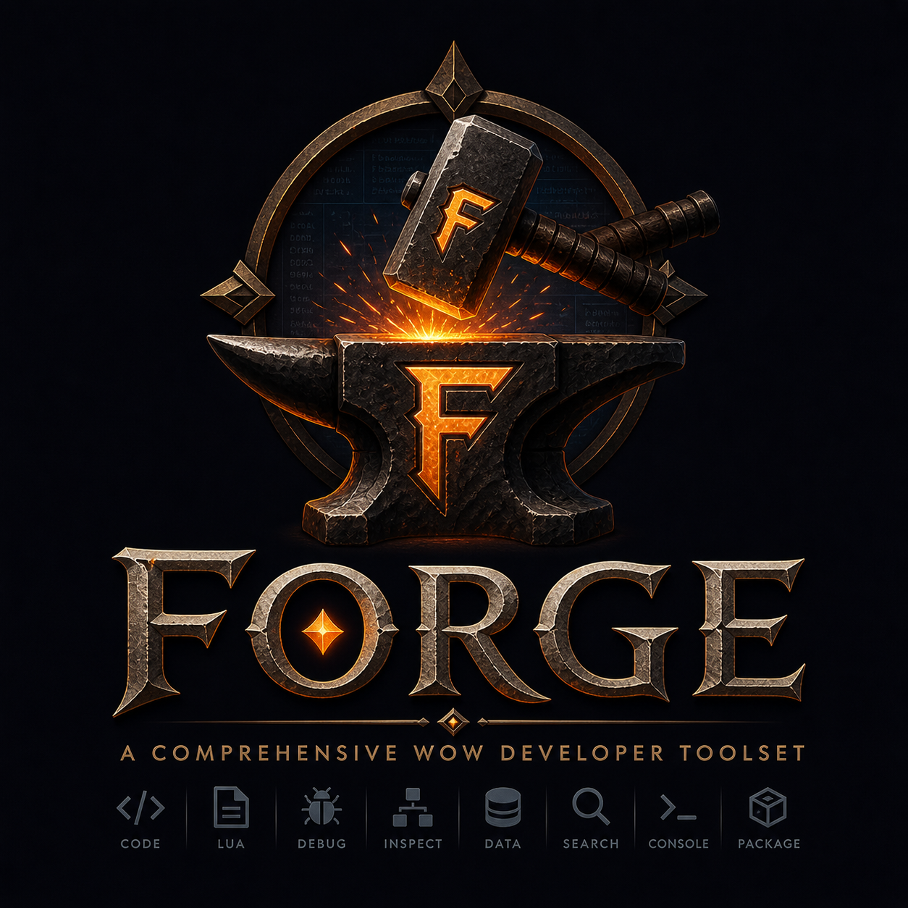

# Forge

<p align="center">
  
</p>

> A comprehensive developer toolset for World of Warcraft addons.

Forge is a parent + sub-addon suite of developer tools for WoW addon
authors who use Cairn and LibCodex. Install only the tools you want; each
sub-addon plugs into the parent's main window as its own tab.

It targets **WoW Retail (Midnight, Interface 120005)** and is built on
the [Cairn](../Cairn/README.md) library stack.

**Status:** v0.1.0-dev. All planned sub-addons shipped: parent +
`Forge_BugCatcher`, `Forge_Console`, `Forge_Macros`, `Forge_AddonManager`,
`Forge_Inspector`, `Forge_Logs` (replaces `Cairn.Dashboard`),
`Forge_Codex` (replaces LibCodex UI), `Forge_Profiles`, `Forge_Registry`.
In-game verification across the full suite remains a pending task.
See [Roadmap](#roadmap).

---

## What's in the box

Forge ships as a small parent addon plus a set of optional sub-addons.
The parent provides the slash router, the sub-module registry, and the
main window. Each sub-addon adds one tool as a tab.

| Sub-addon | Tool | What it does |
|---|---|---|
| `Forge_BugCatcher` | Error handler | Captures Lua errors quietly. Browsable viewer with copy-as-block, minimap counter, ignore list, optional auto-popup, color-coded severity. **Shipped.** |
| `Forge_Macros` | Macro editor | Account + Character macro lists, big text area, char counter, drag-to-bar; plus a Sequences mode that builds a stack of `/cast` lines and compiles to a `/castsequence` macro. **Shipped.** |
| `Forge_Console` | Lua REPL | In-game Lua console with command history, syntax check, scrollable output. **Shipped.** |
| `Forge_Inspector` | Namespace browser | Real-time `_G` tree explorer with type display, per-level search, 0.5s auto-poll on expanded nodes, pinnable watch list. |
| `Forge_Logs` | Activity dashboard | Per-source log viewer with `DLAPI`-style public API, categories + verbosity, search, export to CSV / HTML, optional Events / ChatEvents taps. Replaces Cairn.Dashboard. |
| `Forge_Profiles` | Profile manager | Cross-addon profile switcher, profile manager API, auto-discovery adapters so non-Cairn addons appear automatically. |
| `Forge_Registry` | Registry browser | "What's wired up" view: enumerates Cairn.Addon, Cairn.Hooks, Cairn.Timer, Cairn.Events, Cairn.DB, Cairn.Slash, Cairn.Locale registries, plus LibCodex modules and consumer addons. |
| `Forge_AddonManager` | Addon manager | Toggle addons in-game, named sets (Raid / Solo / PvP), ReloadUI, per-addon memory and load order, sortable columns, status filter, protected addons, export. **Shipped.** |
| `Forge_Codex` | Codex browser | Browse / search / stats over LibCodex's 45-module catalog. Replaces LibCodex's UI. |

---

## Installation

1. Copy the `Forge/` folder into:
   `World of Warcraft\_retail_\Interface\AddOns\Forge\`
2. Copy any `Forge_*` sub-addon folders you want into the same directory.
3. Make sure **Cairn** is also installed (Forge depends on it).
4. `Forge_Codex` additionally requires **LibCodex-1.0**.

After login, type `/forge` to open the main window. With no sub-addons
installed you'll see an empty window with a placeholder message; install
any sub-addon to populate a tab.

---

## Slash commands

The parent registers `/forge` (alias `/fg`). Built-in subcommands:

| Subcommand | Action |
|---|---|
| `/forge` | Toggle the main window |
| `/forge status` | Print Cairn / LibCodex / profile / sub-modules info |
| `/forge modules` | List every loaded Forge sub-module |
| `/forge logs` | Open the Logs tab (or fall back to Cairn.Dashboard) |
| `/forge reset` | Reset the current profile to defaults |
| `/forge help` | List all registered subcommands |

Each sub-addon adds its own subcommand on load (for example `/forge bug`,
`/forge console`, `/forge inspect`). They appear in `/forge help`
automatically.

### Forge_Console specifics

Once `Forge_Console/` is installed, `/forge console` opens the Console
tab. Type Lua at the prompt and press Enter to run. The REPL:

- Tries `return <input>` first so expressions show their result.
- Falls back to running `<input>` as a statement.
- Captures `print()` output into the scrollable pane (and chat).
- Shows syntax errors and runtime errors in red.
- Walks command history via Up / Down arrows, or the `<` / `>` buttons.
- Persists history per character in `ForgeConsoleDB`.

### Forge_BugCatcher specifics

Once `Forge_BugCatcher/` is installed, the global error handler is
replaced with a quiet capture handler at addon load time. The default
WoW error popup no longer appears. Errors are stored in a ring buffer of
500 with timestamp, dedup count, and ignore-list filtering.

- A minimap button (top-right of the minimap by default) shows the
  session error count as a red badge. Click it to open the Bug Catcher
  tab.
- The tab has a list pane on the left (newest first) and a detail pane
  on the right. Click a row to inspect.
- "Show All" opens a popup `EditBox` pre-selected for `Ctrl-C`, formatted
  for pasting into Discord or a GitHub issue.
- "Auto-popup on new error" checkbox in the toolbar opens the tab
  automatically when a new (non-deduped) error arrives. Throttled to
  once per 5s to avoid spam.
- "Ignore" on the detail pane adds the error's `file:line:` prefix to
  a substring ignore list. Future identical errors don't get captured.
- Chains to any previously-installed error handler so other error
  tools keep working.

---

## Writing your own sub-addon

A sub-addon is a regular WoW addon that depends on Forge and registers a
descriptor with `Forge.Registry`:

```lua
-- MySubAddon/MySubAddon.toc
## Interface: 120005
## Title: Forge_MyTool
## Dependencies: Cairn, Forge
Core.lua
```

```lua
-- MySubAddon/Core.lua
Forge.Registry.Register({
    name        = "MyTool",
    title       = "My Tool",
    order       = 50,
    description = "Does the thing.",
    SlashSub    = { name = "mytool", help = "open My Tool" },
    OnTabShow   = function(parent, mod)
        if not mod._built then
            mod._frame = CreateFrame("Frame", nil, parent)
            mod._frame:SetAllPoints(parent)
            -- build your UI here once
            mod._built = true
        end
        mod._frame:Show()
    end,
    OnTabHide = function(parent, mod)
        if mod._frame then mod._frame:Hide() end
    end,
})
```

The descriptor table is your module object; stash any state on it.
Forge never mutates it. The tab strip rebuilds automatically, and
`/forge mytool` is wired automatically.

### Descriptor fields

| Field | Required | Description |
|---|---|---|
| `name` | yes | Short identifier; used as the tab key (no `Forge_` prefix). |
| `title` | no | Human-readable tab label. Defaults to `name`. |
| `order` | no | Tab sort order (lower = leftmost). Default 100. |
| `description` | no | One-line subtitle. |
| `icon` | no | Texture path for a future icon column. |
| `OnTabShow(parent, mod)` | yes | Build or show your UI inside the parent frame. |
| `OnTabHide(parent, mod)` | no | Hide or tear down when another tab takes over. |
| `SlashSub` | no | `{ name = "...", help = "..." }`. Auto-registers a `/forge <name>` subcommand. |

---

## Architecture

Forge is split into the parent and the sub-addons:

- **Forge** (parent): the slash router (built on `Cairn.Slash`), the
  sub-module registry, and the main window. ~520 lines.
- **Forge_*** (sub-addons): each one is a regular WoW addon that calls
  `Forge.Registry.Register(descriptor)` on load.

The parent uses Cairn directly:

- `Cairn.Addon` for lifecycle (`OnInit` / `OnLogin` / `OnLogout`)
- `Cairn.DB` for SavedVariables (the `ForgeDB` global, profile per character)
- `Cairn.Slash` for `/forge` routing
- `Cairn.Log` for diagnostic logging

Forge does not duplicate work already in Cairn. The Logs tab renders
`Cairn.Log`'s ring buffer; the per-addon dashboard work that lives in
`Cairn.Dashboard` today moves into `Forge_Logs` once it ships, after
which the next Cairn release drops `Cairn-Dashboard-1.0.lua`.

---

## Roadmap

**Built:**

- Forge parent (v0.1.0-dev): slash router, registry, main window with
  dynamic tab strip, geometry persistence.
- `Forge_Console`: in-game Lua REPL with command history, syntax check,
  print capture, return-value display, scrollable output, history navigation.
- `Forge_BugCatcher`: quiet error capture, dedup ring, browsable viewer,
  Show All copy popup, auto-popup, ignore list, minimap counter.

**Build order for v0.1:**

1. `Forge_Macros` (macro editor)
2. `Forge_Registry` (registry browser)
3. `Forge_Logs` (activity dashboard with DLAPI compat; replaces `Cairn.Dashboard`)
4. `Forge_Codex` (catalog browser; replaces LibCodex UI)
5. `Forge_Inspector` (Lua namespace browser)
6. `Forge_Profiles` (UI + API + auto-discovery adapters)
7. `Forge_AddonManager` (toggle + sets + memory + profile-aware)

**Migration plan:** once `Forge_Logs` and `Forge_Codex` are verified
in-game, the next Cairn and LibCodex releases drop their dashboards.
Both libraries become headless; the GUI lives in Forge.

---

## File layout

```
Forge/
  Forge.toc       Manifest. Interface 120005, hard dep Cairn, optional dep LibCodex-1.0.
  Core.lua        DB, Cairn.Addon lifecycle, /forge slash router with built-in subcommands.
  Registry.lua    Sub-module registry: descriptor schema, ordered iteration, slash auto-wire.
  Window.lua      Main window: tab strip, content area, geometry persistence, empty-state.
  ForgeLogo.png   Logo.
  README.md       This file.

Forge_Console/    (sub-addon)
  Forge_Console.toc
  Core.lua        DB, Cairn.Addon lifecycle, registers Console descriptor with Forge.Registry.
  Eval.lua        Snippet runner. Print capture, return-value display, syntax-then-statement compile.
  UI.lua          Console tab UI: scrollable output, single-line input, Run / Clear / history buttons.

Forge_BugCatcher/ (sub-addon)
  Forge_BugCatcher.toc
  Core.lua        DB, Cairn.Addon lifecycle, registers BugCatcher descriptor, auto-popup wiring.
  Capture.lua     Error handler installation, dedup ring, ignore list, change-event broadcasting.
  Viewer.lua     Tab UI: toolbar (Show All / Clear / Auto-popup), list pane, detail pane.
  Minimap.lua     Minimap button with session-count badge.
```

---

## License

**All Rights Reserved.** Copyright (c) 2026 ChronicTinkerer.

This software is proprietary. No use, modification, redistribution, or
derivative works without prior written permission of the copyright
holder. End users obtaining unmodified copies through official channels
(CurseForge, Wago, WoWInterface, GitHub releases) may install and run
the addon for personal use within World of Warcraft. See
[LICENSE](LICENSE) for full terms.

Vendored third-party code (LibStub) retains its own license; LibStub is
public domain.

The library dependencies — `Cairn` and `LibCodex-1.0` — are MIT-licensed
and unaffected by this change.

Author: **ChronicTinkerer**

Naming family: Cairn (stones / foundation), Codex (book / data),
Vellum (page / rendered guide), Forge (workshop / dev tools).
